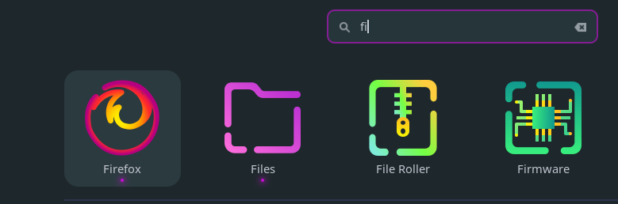
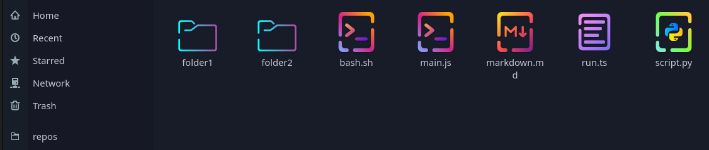

# Sweet Candy Icons and Theme

Icon theme and GTK/Shell theme for GNOME 50+.





## Install

```sh
bun run install
```

- or manually
- see Install Details section below for details

## Icons

- apps, devices, status icons from [Candy](https://github.com/EliverLara/candy-icons)
- places, folders from [Sweet folders](https://github.com/EliverLara/Sweet-folders)

- fallbacks to Papirus-Dark then breeze, gnome and hicolor
- Works without Papirus-Dark installed; the fallback chain is used only for the few icons not covered

### Manual Install
- copy Sweet-Candy-Icons folder to ~/.icons
- set the new icon theme in GNOME Tweaks

## GTK and GNOME Shell Theme

- based on [Sweet](https://github.com/EliverLara/Sweet)
- ported to GNOME 50+ with small fixes and polish
    - libadwaita fixes
    - Sidebar restyled for the GNOME 50 widget tree
    - source ported to modern Dart Sass compatible
    - GtkSourceView editors keep their own style scheme colors, as they do under GTK 3
    - Sweet-Dark palette (magenta accent, dark headerbar) applied at the SCSS variable level; teal hardcodes replaced by the accent variable

### Install Details

```sh
bun run install
```

- This copies the icons to `~/.icons/Sweet-Candy-Icons`, the theme to `~/.themes/Sweet-Candy-Theme`, and applies the GNOME settings (icon theme, GTK theme, shell theme via the User Themes extension, prefer-dark). Restart running apps afterwards.

- libadwaita apps ignore the GTK theme setting and only read `~/.config/gtk-4.0/gtk.css`. The installer writes a one-line import there pointing at the theme in `~/.themes`; an existing file is kept as `gtk.css.bak`.

## Development

The theme is compiled from `Sweet-Candy-Theme/src/` (SCSS); the compiled CSS is committed so installing needs no build.

```sh
bun install       # sass, prettier
bun run build     # compile gtk-3.0, gtk-4.0 and gnome-shell stylesheets
bun run format    # prettier over the SCSS
```